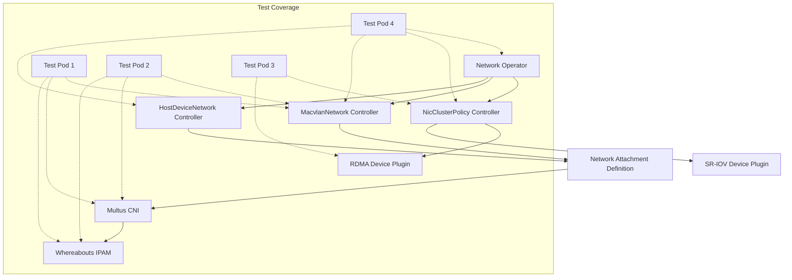

# Network Operator Test Pods

This directory contains various test pods to validate and understand the network-operator functionality. Some components can be tested in kind, while others require real hardware.

## Testing Limitations in kind

### What Can Be Tested in kind
1. **MacvlanNetwork CR**:
   - Network attachment creation
   - IP address management
   - Multi-network configuration
   - Network isolation
   - Multus CNI integration
   - Whereabouts IPAM functionality

2. **Operator Core**:
   - CRD installation
   - CR validation
   - Basic operator functionality
   - Status reporting
   - Event generation

### What Cannot Be Tested in kind
1. **NicClusterPolicy CR** (requires real hardware):
   - OFED driver installation (requires real Mellanox NICs)
   - RDMA device discovery and configuration
   - SR-IOV configuration
   - Real RDMA resource allocation
   - Hardware-specific features

2. **Hardware Features**:
   - Actual RDMA communication
   - SR-IOV virtual function creation
   - Hardware offloading
   - Real network performance
   - Device-specific functionality

### Test Pod Capabilities in kind

1. **Basic Network Test (`01-basic-network-pod.yaml`)**
   - ✅ Can test: Network attachment, IP allocation, basic connectivity
   - ❌ Cannot test: RDMA functionality, hardware offloading

2. **Multi-Network Test (`02-multi-network-pod.yaml`)**
   - ✅ Can test: Multiple network attachments, IP allocation, network isolation
   - ❌ Cannot test: RDMA over multiple interfaces, hardware-based isolation

3. **Resource Test (`03-resource-test-pod.yaml`)**
   - ⚠️ Limited testing only:
     - Can verify resource definition and request workflow
     - Cannot actually allocate or use RDMA resources
     - Mock device plugin can simulate resource availability
     - No real RDMA functionality available

4. **Operator Validation (`04-operator-validation-pod.yaml`)**
   - ✅ Can test: Operator deployment, CRD installation, CR validation
   - ⚠️ Partial testing: NicClusterPolicy status monitoring
   - ❌ Cannot test: Real hardware status, OFED driver status

### Recommended Testing Approach

1. **Local Testing in kind**:
   ```bash
   # Test network attachment functionality
   kubectl apply -f 01-basic-network-pod.yaml
   kubectl apply -f 02-multi-network-pod.yaml

   # Monitor operator functionality
   kubectl apply -f 04-operator-validation-pod.yaml
   ```

2. **Hardware Testing (requires real cluster with Mellanox NICs)**:
   ```bash
   # Apply NicClusterPolicy first
   kubectl apply -f path/to/nicclusterpolicy.yaml

   # Wait for OFED and device plugins
   kubectl -n nvidia-network-operator wait --for=condition=ready pod -l app=nvidia-network-operator

   # Then test RDMA functionality
   kubectl apply -f 03-resource-test-pod.yaml
   ```

### Understanding NicClusterPolicy in kind

When applying NicClusterPolicy in kind:
1. The operator will accept and validate the CR
2. Status will be updated
3. But hardware-dependent components will fail:
   - OFED driver pods will fail to start
   - Device plugin won't find any devices
   - No RDMA resources will be available

Example status in kind:
```yaml
status:
  conditions:
    - lastTransitionTime: "2023-07-23T12:34:56Z"
      message: "No supported devices found"
      reason: "NoDevicesFound"
      status: "False"
      type: "Ready"
```

## Test Pod Overview

### 1. Basic Network Test (`01-basic-network-pod.yaml`)
**Purpose**: Tests basic network attachment and configuration capabilities.

**Components Tested**:
- MacvlanNetwork CRD controller
- Network Attachment Definition creation
- Multus CNI integration
- Whereabouts IPAM functionality

**What it validates**:
- Network interface creation
- IP address assignment
- Basic network connectivity
- Network configuration application

### 2. Multi-Network Test (`02-multi-network-pod.yaml`)
**Purpose**: Tests multiple network attachment capabilities and network isolation.

**Components Tested**:
- Multiple MacvlanNetwork instances
- Multiple Network Attachment Definitions
- Multus CNI multi-network capability
- Whereabouts IPAM across multiple networks

**What it validates**:
- Multiple interface creation
- Network isolation
- Concurrent IP management
- Cross-network routing

### 3. Resource Test (`03-resource-test-pod.yaml`)
**Purpose**: Tests RDMA resource allocation and management.

**Components Tested**:
- NicClusterPolicy RDMA configuration
- RDMA shared device plugin
- Kubernetes resource management
- Device plugin framework integration

**What it validates**:
- RDMA resource availability
- Resource allocation
- Resource limits enforcement
- Device plugin functionality

### 4. Operator Validation (`04-operator-validation-pod.yaml`)
**Purpose**: Monitors overall operator health and component status.

**Components Tested**:
- Network Operator core functionality
- All CRD controllers
- Resource status
- Network plugin health
- Policy configurations

**What it validates**:
- Operator deployment status
- CRD availability and versions
- Resource distribution
- Plugin health
- Policy application

## Component Interaction Diagram



## Test Dependencies

Each test pod requires specific components to be available:

1. **Basic Network Test**:
   - Network Operator
   - Multus CNI
   - Whereabouts CNI
   - MacvlanNetwork CRD

2. **Multi-Network Test**:
   - All Basic Network Test requirements
   - Multiple network support in Multus
   - Multiple IP pools in Whereabouts

3. **Resource Test**:
   - Network Operator
   - NicClusterPolicy CRD
   - RDMA device plugin
   - Mock RDMA resources (for kind)

4. **Operator Validation**:
   - Network Operator
   - All CRDs
   - RBAC permissions
   - Monitoring access

## Prerequisites

Before running any test pods, ensure you have the following components installed and configured:

1. **Base Requirements**
   ```bash
   # Create kind cluster with multiple nodes
   kind create cluster --config ../kind-multi-node.yaml

   # Install CNI plugins on all nodes
   # Option 1: Using the provided script (recommended)
   ./scripts/install-cni-plugins.sh

   # Option 2: Manual installation
   # Note: This example detects your architecture automatically
   ARCH=$(uname -m)
   case ${ARCH} in
       x86_64)  ARCH="amd64" ;;
       aarch64|arm64) ARCH="arm64" ;;
       *) echo "Unsupported architecture: ${ARCH}"; exit 1 ;;
   esac

   for node in $(kubectl get nodes -o jsonpath='{.items[*].metadata.name}'); do
     echo "Installing CNI plugins on node ${node}"
     docker exec ${node} mkdir -p /opt/cni/bin
     # Install standard CNI plugins (includes macvlan)
     docker exec ${node} curl -L "https://github.com/containernetworking/plugins/releases/download/v1.3.0/cni-plugins-linux-${ARCH}-v1.3.0.tgz" | \
       docker exec -i ${node} tar xz -C /opt/cni/bin
   done

   # Install Network Operator
   helm repo add nvidia https://helm.ngc.nvidia.com/nvidia
   helm repo update

   helm install network-operator nvidia/network-operator \
     -n nvidia-network-operator \
     --create-namespace \
     --version v25.4.0 \
     --wait

   # Install Multus CNI
   kubectl apply -f https://raw.githubusercontent.com/k8snetworkplumbingwg/multus-cni/master/deployments/multus-daemonset.yml

   # Install Whereabouts CNI
   helm install whereabouts oci://ghcr.io/k8snetworkplumbingwg/whereabouts-chart

   # Verify CNI installations
   kubectl -n kube-system get pods -l app=multus
   kubectl -n kube-system get pods -l name=whereabouts

   # Verify CNI plugins installation on nodes
   for node in $(kubectl get nodes -o jsonpath='{.items[*].metadata.name}'); do
     echo "=== Checking CNI plugins on ${node} ==="
     docker exec ${node} ls -l /opt/cni/bin/
   done
   ```

**Note for Apple Silicon (M1/M2) Users:**
The script and instructions above will automatically detect your ARM64 architecture and download the appropriate CNI plugins. If you're running into any architecture-related issues, verify that:
1. Your kind cluster is running ARM64 nodes (this is automatic on M1/M2 Macs)
2. The downloaded CNI plugins are the ARM64 version
3. All container images support ARM64 architecture

You can verify the architecture of your nodes with:
```bash
for node in $(kubectl get nodes -o jsonpath='{.items[*].metadata.name}'); do
  echo "=== ${node} architecture ==="
  docker exec ${node} uname -m
done
```

2. **Required Custom Resources**
   ```bash
   # Deploy NicClusterPolicy (required for all network-related tests)
   kubectl apply -f ../example/crs/mellanox.com_v1alpha1_nicclusterpolicy_cr.yaml

   # Verify NicClusterPolicy status
   kubectl get NicClusterPolicy
   kubectl describe NicClusterPolicy nic-cluster-policy

   # Check if any validation errors occurred
   kubectl get events --field-selector type=Warning

   # If you see validation errors, check the operator logs
   kubectl logs -n nvidia-network-operator -l app.kubernetes.io/name=network-operator

   # Deploy MacvlanNetwork (required for network interface tests)
   kubectl apply -f ../example/crs/mellanox.com_v1alpha1_macvlannetwork_cr.yaml

   # Verify resources are ready
   kubectl get NicClusterPolicy
   kubectl get MacvlanNetwork
   kubectl get network-attachment-definitions -A
   ```

### Troubleshooting CR Installation

If you encounter errors when applying the CRs:

1. **Schema Validation Errors**
   ```bash
   # Check the CRD schema
   kubectl get crd nicclusterpolicies.mellanox.com -o yaml | less

   # Check operator logs for validation details
   kubectl logs -n nvidia-network-operator -l app=network-operator
   ```

2. **Resource Status**
   ```bash
   # Check resource status and events
   kubectl describe NicClusterPolicy nic-cluster-policy
   kubectl get events --field-selector involvedObject.kind=NicClusterPolicy
   ```

3. **Common Issues**
   - Ensure the operator is running before applying CRs
   - Verify CRD versions match your operator version
   - Check that all required fields in CRs are properly formatted
   - Ensure container images and versions are accessible

## Custom Resource (CR) Interactions

### NicClusterPolicy CR Flow
The NicClusterPolicy CR is the primary configuration resource that sets up the cluster-wide networking components. Here's how it's exercised:

1. **Initial Setup**
   ```yaml
   # Applied before running tests
   apiVersion: mellanox.com/v1alpha1
   kind: NicClusterPolicy
   metadata:
     name: nic-cluster-policy
   spec:
     ofedDriver:
       image: nvcr.io/nvidia/mellanox/driver
       repository: nvcr.io/nvidia/mellanox
       version: 5.4-3.1.0.0
     rdmaSharedDevicePlugin:
       config: |
         {
           "configList": [{
             "resourceName": "rdma_shared_device_a",
             "rdmaHcaMax": 63
           }]
         }
   ```
   This CR:
   - Configures OFED driver deployment
   - Sets up RDMA device plugin
   - Defines available RDMA resources

2. **Test Pod Interactions**:
   - **Resource Test Pod (03)**: Directly exercises the RDMA resources configured by NicClusterPolicy
     ```yaml
     # From 03-resource-test-pod.yaml
     resources:
       requests:
         nvidia.com/rdma: 1
       limits:
         nvidia.com/rdma: 1
     ```
     When this pod is scheduled:
     1. Kubernetes checks for RDMA resources
     2. RDMA device plugin (configured by NicClusterPolicy) handles the resource allocation
     3. Pod gets access to RDMA resources

   - **Operator Validation Pod (04)**: Monitors NicClusterPolicy status
     ```bash
     kubectl get NicClusterPolicy
     kubectl get pods -n nvidia-network-operator  # Shows OFED and device plugin pods
     ```

### MacvlanNetwork CR Flow
The MacvlanNetwork CR defines secondary networks. Here's how it's exercised:

1. **Network Definition**
   ```yaml
   # Applied for network tests
   apiVersion: mellanox.com/v1alpha1
   kind: MacvlanNetwork
   metadata:
     name: test-network
   spec:
     networkNamespace: "default"
     master: "eth0"
     mode: "bridge"
     ipam: |
       {
         "type": "whereabouts",
         "range": "192.168.2.225/28"
       }
   ```
   This CR:
   - Defines a macvlan network interface
   - Configures IPAM
   - Creates corresponding NetworkAttachmentDefinition

2. **Test Pod Interactions**:
   - **Basic Network Test Pod (01)**: Tests single network attachment
     ```yaml
     # From 01-basic-network-pod.yaml
     metadata:
       annotations:
         k8s.v1.cni.cncf.io/networks: test-network
     ```
     Flow:
     1. MacvlanNetwork CR creates NetworkAttachmentDefinition
     2. Pod requests network attachment
     3. Multus CNI reads NetworkAttachmentDefinition
     4. Network is configured on pod

   - **Multi-Network Test Pod (02)**: Tests multiple network attachments
     ```yaml
     # From 02-multi-network-pod.yaml
     metadata:
       annotations:
         k8s.v1.cni.cncf.io/networks: test-network-1,test-network-2
     ```
     Flow:
     1. Multiple MacvlanNetwork CRs create multiple NetworkAttachmentDefinitions
     2. Pod requests multiple network attachments
     3. Multus CNI configures multiple interfaces
     4. Each network gets its own IP from Whereabouts IPAM

### CR Status Verification
The operator validation pod (04) continuously monitors CR status:

```bash
# NicClusterPolicy status
kubectl get NicClusterPolicy -o yaml | grep -A 10 "status:"
# Shows:
# - OFED driver deployment status
# - Device plugin status
# - Resource availability

# MacvlanNetwork status
kubectl get MacvlanNetwork -o yaml | grep -A 5 "status:"
# Shows:
# - Network configuration status
# - NetworkAttachmentDefinition creation status
```

### Component Chain
1. **NicClusterPolicy Flow**:
   ```
   NicClusterPolicy CR
   → Network Operator Controller
   → OFED Driver Deployment
   → RDMA Device Plugin Deployment
   → Resource Available in Cluster
   → Pod Resource Allocation
   ```

2. **MacvlanNetwork Flow**:
   ```
   MacvlanNetwork CR
   → Network Operator Controller
   → NetworkAttachmentDefinition Creation
   → Multus CNI Configuration
   → Pod Network Attachment
   → Whereabouts IP Allocation
   ```

## Test Pod Dependencies

### 1. Basic Network Test (`01-basic-network-pod.yaml`)
**Required Resources:**
- NicClusterPolicy (status: ready)
- MacvlanNetwork (for the test-network attachment)

```bash
# Verify prerequisites
kubectl get NicClusterPolicy
kubectl get MacvlanNetwork
kubectl get network-attachment-definitions -A

# Apply the test
kubectl apply -f 01-basic-network-pod.yaml
```

### 2. Multi-Network Test (`02-multi-network-pod.yaml`)
**Required Resources:**
- NicClusterPolicy (status: ready)
- Multus CNI installed and running
- Whereabouts CNI installed and running
- The pod yaml includes both network definitions

```bash
# Verify prerequisites
kubectl -n kube-system get pods -l app=multus
kubectl -n kube-system get pods -l name=whereabouts

# Check CNI configuration
for node in $(kubectl get nodes -o name); do
  echo "=== Checking CNI config on ${node} ==="
  kubectl debug ${node#node/} -it --image=busybox -- ls -l /host/etc/cni/net.d/
done

# Apply the test (this will create both network definitions)
kubectl apply -f 02-multi-network-pod.yaml

# Verify network definitions were created
kubectl get network-attachment-definitions
kubectl describe network-attachment-definitions test-network-1
kubectl describe network-attachment-definitions test-network-2

# Wait for pod to be ready
kubectl wait --for=condition=ready pod/multi-network-test --timeout=60s

# Check pod status and networks
kubectl describe pod multi-network-test | grep networks
kubectl logs multi-network-test

# For debugging network issues
kubectl describe pod multi-network-test
kubectl logs -n kube-system -l app=multus
kubectl logs -n kube-system -l name=whereabouts
```

**Expected Output:**
The pod should show three network interfaces:
- eth0: Default Kubernetes network
- net1: From test-network-1 (192.168.1.0/24)
- net2: From test-network-2 (192.168.2.0/24)

**Troubleshooting:**
If networks are not attached:

1. Verify Multus and Whereabouts are running:
   ```bash
   # Check Multus
   kubectl -n kube-system get pods -l app=multus
   kubectl -n kube-system logs -l app=multus

   # Check Whereabouts
   kubectl -n kube-system get pods -l name=whereabouts
   kubectl -n kube-system logs -l name=whereabouts
   ```

2. Check network definitions:
   ```bash
   # Get all network definitions
   kubectl get network-attachment-definitions -o yaml

   # Check events
   kubectl get events --field-selector involvedObject.kind=NetworkAttachmentDefinition
   ```

3. Check CNI configuration on nodes:
   ```bash
   # Debug on a specific node
   NODE_NAME=$(kubectl get pod multi-network-test -o jsonpath='{.spec.nodeName}')
   kubectl debug node/$NODE_NAME -it --image=busybox -- chroot /host sh -c \
     "ls -l /etc/cni/net.d/ && cat /etc/cni/net.d/*.conf*"
   ```

4. Check pod annotations and events:
   ```bash
   # Check pod annotations
   kubectl get pod multi-network-test -o jsonpath='{.metadata.annotations}' | jq

   # Check pod events
   kubectl get events --field-selector involvedObject.name=multi-network-test
   ```

### 3. Resource Test (`03-resource-test-pod.yaml`)
**Required Resources:**
- NicClusterPolicy (status: ready)
- Mock RDMA Device Plugin (for local testing)

```bash
# For local testing, deploy the mock device plugin first
kubectl apply -f mock-device-plugin.yaml

# Wait for the mock device plugin to be ready
kubectl -n kube-system wait --for=condition=ready pod -l name=mock-rdma-device-plugin

# Verify RDMA resources are available
kubectl get nodes -o custom-columns=NAME:.metadata.name,RDMA:.status.allocatable.nvidia\\\.com/rdma

# Apply the test
kubectl apply -f 03-resource-test-pod.yaml

# Wait for pod to be ready
kubectl wait --for=condition=ready pod/resource-test --timeout=60s

# View resource information
kubectl logs resource-test
```

**Expected Output with Mock Device Plugin:**
```
=== CPU Info ===
[CPU information]

=== Memory Info ===
[Memory information]

=== RDMA Devices ===
ibstat not found - RDMA tools not installed
No InfiniBand devices found in /dev/infiniband/

=== NVIDIA Devices ===
nvidia-smi not found - NVIDIA tools not installed
No NVIDIA devices found

=== Kubernetes Resource Allocation ===
Requests:
  CPU: 100m
  Memory: 64Mi
  RDMA: 1
Limits:
  CPU: 200m
  Memory: 128Mi
  RDMA: 1
```

**Note:** When testing locally with the mock device plugin:
1. The pod will schedule successfully and get the requested RDMA resources
2. No actual RDMA devices will be present in the pod (this is expected)
3. The test validates that the Kubernetes resource allocation works correctly
4. For real RDMA testing, use a cluster with actual Mellanox hardware

### 4. Operator Validation (`04-operator-validation-pod.yaml`)
**Required Resources:**
- Only requires the operator to be running
- No additional CRs needed

```bash
# Verify operator is running
kubectl get pods -n nvidia-network-operator

# Apply the test
kubectl apply -f 04-operator-validation-pod.yaml
```

### Additional Test Scenarios in kind

Beyond the basic functionality, the following aspects can also be tested in kind:

1. **HostDeviceNetwork CR** (`05-hostdevice-network-test.yaml`)
   - Network attachment definition creation
   - Host device network configuration
   - Network interface management
   - IPAM configuration
   Note: While the CR functionality can be tested, actual host devices might not be available in kind.

2. **Configuration Updates and Validation** (`06-config-update-test.yaml`)
   Tests the operator's handling of:
   - Invalid configurations
   - Configuration updates
   - Error conditions
   - Status reporting
   - Validation webhooks
   - Resource updates

3. **Operator Behavior Testing**
   The following can be tested without real hardware:
   - CR validation logic
   - Status updates and conditions
   - Event generation
   - Error handling
   - Resource cleanup
   - Configuration persistence

4. **Network Plugin Integration**
   Can test integration with:
   - Multus CNI
   - Whereabouts IPAM
   - Standard CNI plugins
   - Network attachment definitions

5. **Operator Upgrade Testing**
   Can test:
   - CRD version compatibility
   - Configuration migration
   - Resource version updates
   - API compatibility

### Example Test Scenarios

1. **Testing HostDeviceNetwork**:
   ```bash
   # Apply host device network test
   kubectl apply -f 05-hostdevice-network-test.yaml

   # Verify network attachment definition
   kubectl get network-attachment-definitions
   ```

2. **Testing Configuration Updates**:
   ```bash
   # Apply configuration test
   kubectl apply -f 06-config-update-test.yaml

   # Monitor test results
   kubectl logs -f config-update-test
   ```

3. **Testing Error Handling**:
   ```bash
   # Create invalid configuration
   kubectl apply -f test-pods/examples/invalid-config.yaml

   # Check operator's response
   kubectl get events --field-selector type=Warning
   ```

### What to Look For

1. **Configuration Validation**:
   - Proper rejection of invalid configurations
   - Meaningful error messages
   - Appropriate status updates
   - Event generation

2. **Update Handling**:
   - Graceful handling of configuration changes
   - Proper status updates during changes
   - Resource recreation when needed
   - Configuration persistence

3. **Error Recovery**:
   - Recovery from invalid states
   - Proper error reporting
   - Status condition updates
   - Event generation

4. **Resource Management**:
   - Proper creation of dependent resources
   - Cleanup of resources
   - Resource version handling
   - Owner reference management

## Running All Tests in Sequence

Here's the complete sequence to set up and run all tests:

```bash
# 1. Create cluster and install operator
kind create cluster --config ../kind-multi-node.yaml

helm repo add nvidia https://helm.ngc.nvidia.com/nvidia
helm repo update

helm install network-operator nvidia/network-operator \
  -n nvidia-network-operator \
  --create-namespace \
  --version v25.4.0 \
  --wait

# 2. Deploy required CRs
kubectl apply -f ../example/crs/mellanox.com_v1alpha1_nicclusterpolicy_cr.yaml
kubectl apply -f ../example/crs/mellanox.com_v1alpha1_macvlannetwork_cr.yaml

# 3. Wait for resources to be ready
echo "Waiting for NicClusterPolicy to be ready..."
kubectl wait --for=condition=ready NicClusterPolicy --all --timeout=300s

echo "Waiting for network attachments to be available..."
kubectl wait --for=condition=established crd/network-attachment-definitions.k8s.cni.cncf.io --timeout=60s

# 4. Apply test pods in sequence
kubectl apply -f 01-basic-network-pod.yaml
kubectl wait --for=condition=ready pod/basic-network-test --timeout=60s

kubectl apply -f 02-multi-network-pod.yaml
kubectl wait --for=condition=ready pod/multi-network-test --timeout=60s

kubectl apply -f 03-resource-test-pod.yaml
kubectl wait --for=condition=ready pod/resource-test --timeout=60s

kubectl apply -f 04-operator-validation-pod.yaml
kubectl wait --for=condition=ready pod/operator-validation --timeout=60s

# 5. Monitor results
kubectl get pods -w
```

## Verifying Test Results

For each test pod, you can verify the results:

```bash
# Basic Network Test
kubectl logs basic-network-test

# Multi-Network Test
kubectl logs multi-network-test
kubectl exec -it multi-network-test -- ip addr show

# Resource Test
kubectl logs resource-test
kubectl describe pod resource-test

# Operator Validation
kubectl logs -f operator-validation
```

## Troubleshooting

### Common Issues

1. **Pods Stuck in Pending State**
   ```bash
   # Check node resources
   kubectl describe node
   # Check for network attachment issues
   kubectl describe pod <pod-name>
   ```

2. **Network Attachment Issues**
   ```bash
   # Verify network definitions
   kubectl get network-attachment-definitions -A
   # Check CNI configuration
   kubectl get NicClusterPolicy
   ```

3. **Resource Allocation Issues**
   ```bash
   # Check available resources
   kubectl describe node | grep nvidia.com
   # Verify device plugin status
   kubectl get pods -n nvidia-network-operator
   ```

## Cleanup

```bash
# Delete test pods
kubectl delete -f ./

# Remove CRs
kubectl delete -f ../example/crs/mellanox.com_v1alpha1_nicclusterpolicy_cr.yaml
kubectl delete -f ../example/crs/mellanox.com_v1alpha1_macvlannetwork_cr.yaml

# Uninstall operator
helm uninstall -n nvidia-network-operator network-operator

# Delete cluster
kind delete cluster --name netop-test-multi
```

## Test Pod Features

1. **Network Troubleshooting Tools**
   - All pods use `nicolaka/netshoot` image
   - Contains common networking tools
   - Includes debugging utilities

2. **Monitoring Capabilities**
   - Real-time network interface monitoring
   - Resource usage tracking
   - Operator status checking

3. **Resource Management**
   - Tests various resource requests
   - Validates resource limits
   - Checks device plugin functionality

4. **Network Configuration**
   - Tests multiple network attachments
   - Validates routing configurations
   - Checks CNI plugin functionality

## Expected Results

1. **Basic Network Test**
   - Should show additional network interface
   - Should have correct IP address
   - Should have proper routing table

2. **Multi-Network Test**
   - Should show multiple interfaces
   - Should have separate IP addresses
   - Should have correct routing rules

3. **Resource Test**
   - Should show resource requests
   - May show "device not found" (expected in kind)
   - Should respect CPU/memory limits

4. **Operator Validation**
   - Should show operator running
   - Should list expected CRDs
   - Should show network configurations

## Troubleshooting

1. **Pod Pending State**
   - Check node resources
   - Verify operator status
   - Check for network plugin errors

2. **Network Issues**
   - Verify NetworkAttachmentDefinition
   - Check CNI configuration
   - Validate network plugin logs

3. **Resource Problems**
   - Verify NicClusterPolicy
   - Check device plugin status
   - Validate resource availability

### Additional Network Operator Features

The following additional features can be tested in kind:

1. **IPoIB Networks** (`07-ipoib-network-test.yaml`)
   - IPoIBNetwork CR validation
   - Network attachment creation
   - IPAM configuration
   Note: While the CR can be tested, actual IPoIB functionality requires real InfiniBand hardware.

2. **Node Selector Support** (`08-node-selector-test.yaml`)
   - Network targeting using node labels
   - Network attachment restrictions
   - Node selection validation
   - Label-based network distribution

3. **Operator Metrics** (`09-metrics-test.yaml`)
   - Prometheus metrics exposure
   - Reconciliation metrics
   - Error metrics
   - Build information

### Feature-Specific Testing

1. **IPoIB Network Testing**:
   ```bash
   # Apply IPoIB network test
   kubectl apply -f 07-ipoib-network-test.yaml

   # Check network creation
   kubectl get ipoibnetworks
   kubectl get network-attachment-definitions
   ```

2. **Node Selector Testing**:
   ```bash
   # Apply node selector test
   kubectl apply -f 08-node-selector-test.yaml

   # Verify network restrictions
   kubectl get macvlannetwork selector-test-net -o yaml
   ```

3. **Metrics Testing**:
   ```bash
   # Apply metrics test
   kubectl apply -f 09-metrics-test.yaml

   # View metrics data
   kubectl logs -f metrics-test
   ```

### What Can Be Tested

1. **IPoIB Networks**:
   - CR validation
   - Network definition creation
   - IPAM configuration
   - Status reporting
   Note: Actual IPoIB functionality requires real hardware

2. **Node Selector Feature**:
   - Network restriction to specific nodes
   - Label-based network distribution
   - Node selection validation
   - Network attachment enforcement

3. **Operator Metrics**:
   - Build information
   - Reconciliation counters
   - Error metrics
   - Performance metrics

### Testing Matrix

| Feature | Can Test in kind | Requires Hardware | Notes |
|---------|------------------|-------------------|--------|
| MacvlanNetwork | ✅ Full | No | Network attachment only |
| HostDeviceNetwork | ✅ Partial | No | No real devices |
| IPoIBNetwork | ✅ Partial | Yes | No IB hardware |
| Node Selectors | ✅ Full | No | Full functionality |
| RDMA Resources | ❌ No | Yes | Requires RDMA hardware |
| Operator Metrics | ✅ Full | No | Full functionality |
